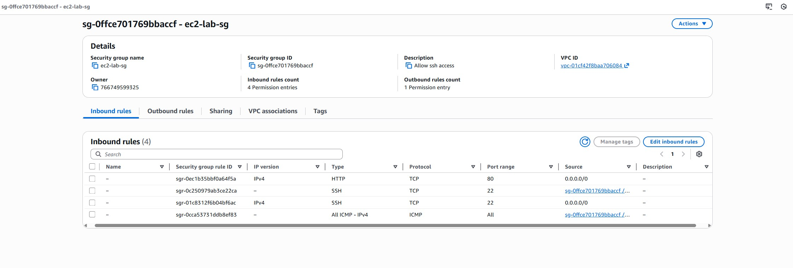
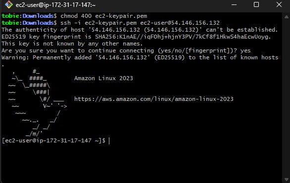
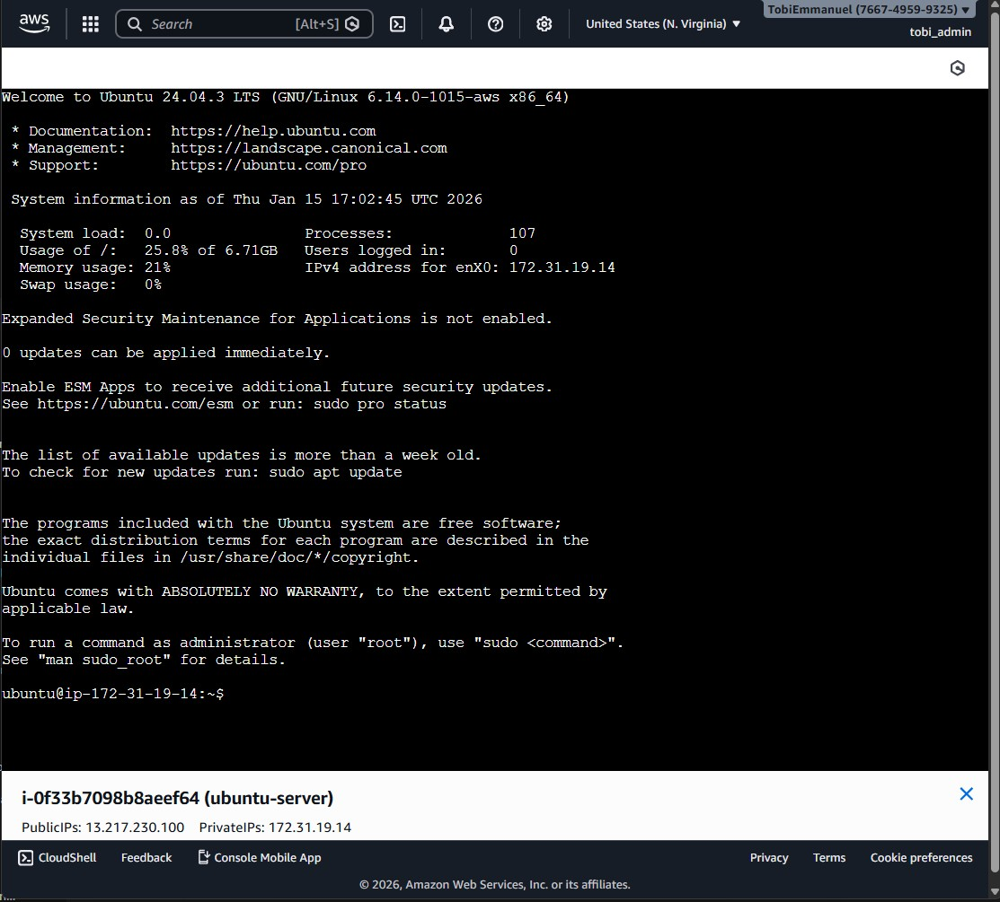
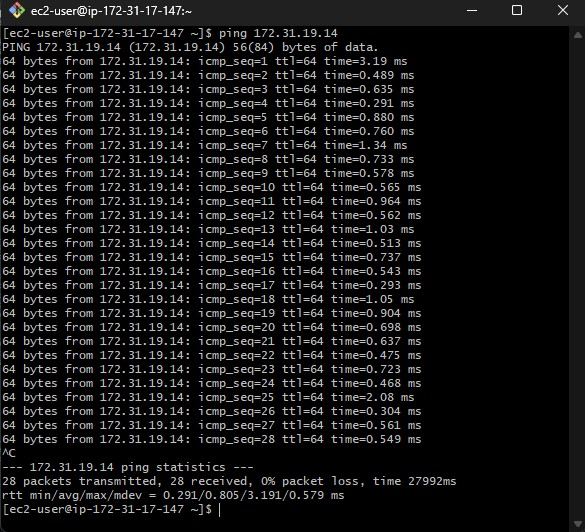
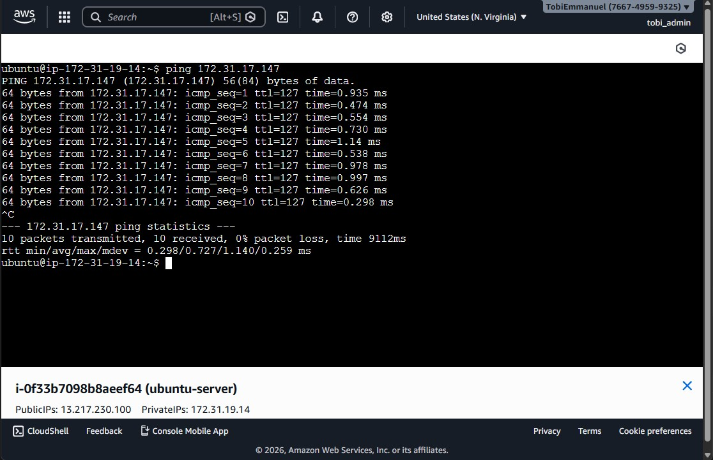
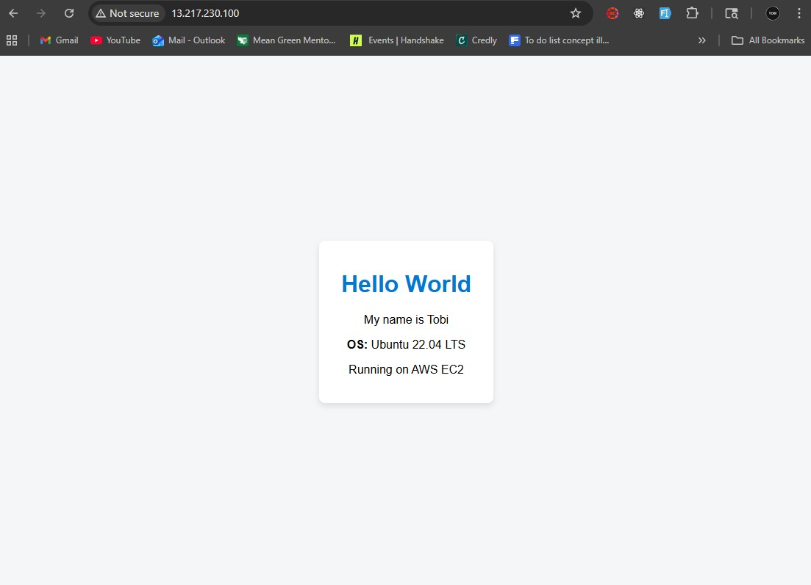

### 1. Create a security group with necessary permissions
<p align="center">
  
</p>

---

### 2. Create Amazon Linux EC2 instance
### 3. Create Ubuntu EC2 instance

---

### 4. Connect to Amazon Linux instance using SSH client
<p align="center">
  
</p>

---

### 5. Connect to Ubuntu instance using EC2 Instance Connect
<p align="center">
  
</p>

---

### 6. From Amazon Linux instance, ping the private IP of the Ubuntu instance
<p align="center">
  
</p>

---

### 7. From Ubuntu instance, ping the private IP of the Amazon Linux instance
<p align="center">
  
</p>

---

### 8. Install Nginx on Ubuntu
```bash
sudo apt update
sudo apt install nginx -y
sudo systemctl start nginx
sudo systemctl enable nginx
```

---

### 9. Install Apache on Amazon Linux
```bash
sudo yum update -y
sudo yum install httpd -y
sudo systemctl start httpd
sudo systemctl enable httpd
```

---

### 10. Create “Hello World” page with OS information
```bash
sudo nano /var/www/html/index.html
```

---

### 11. Make website accessible from the Internet
```text
http://PUBLIC_IP
```

---

### 12. Result
#### Ubuntu (Nginx)
<p align="center">
  
</p>

---
### 13. Result
#### Amazon Linux (Apache)
<p align="center">
  
</p>
