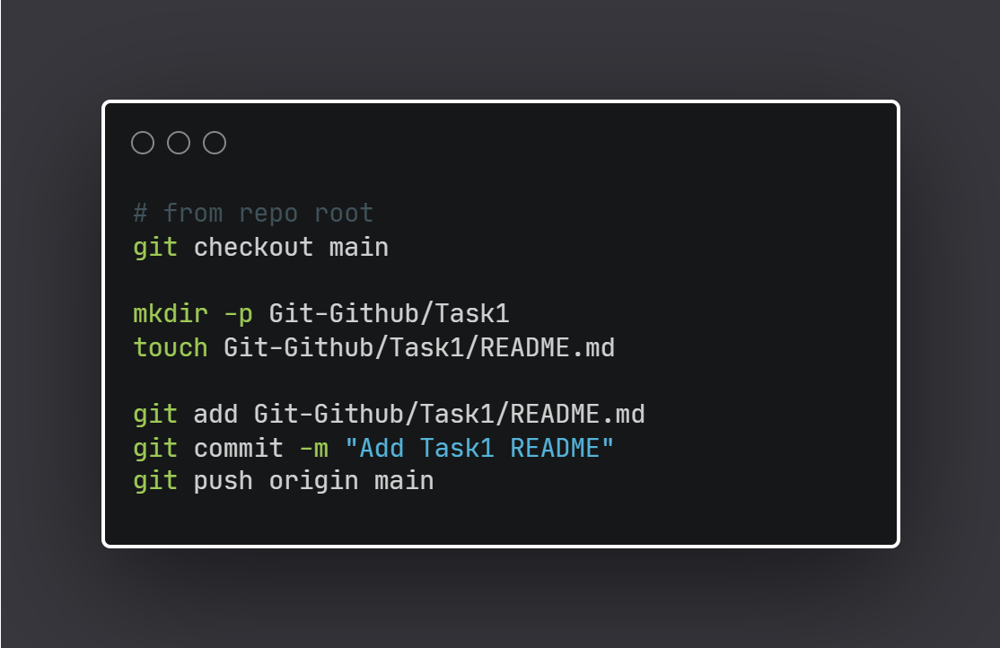
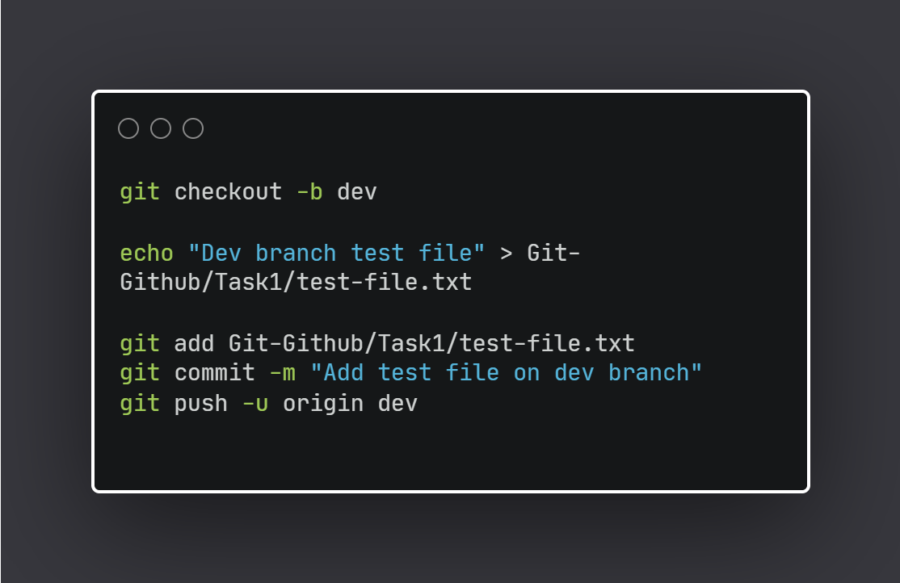
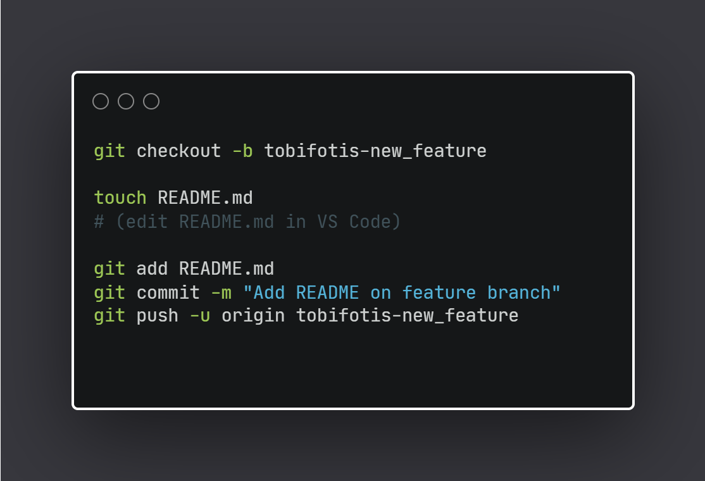
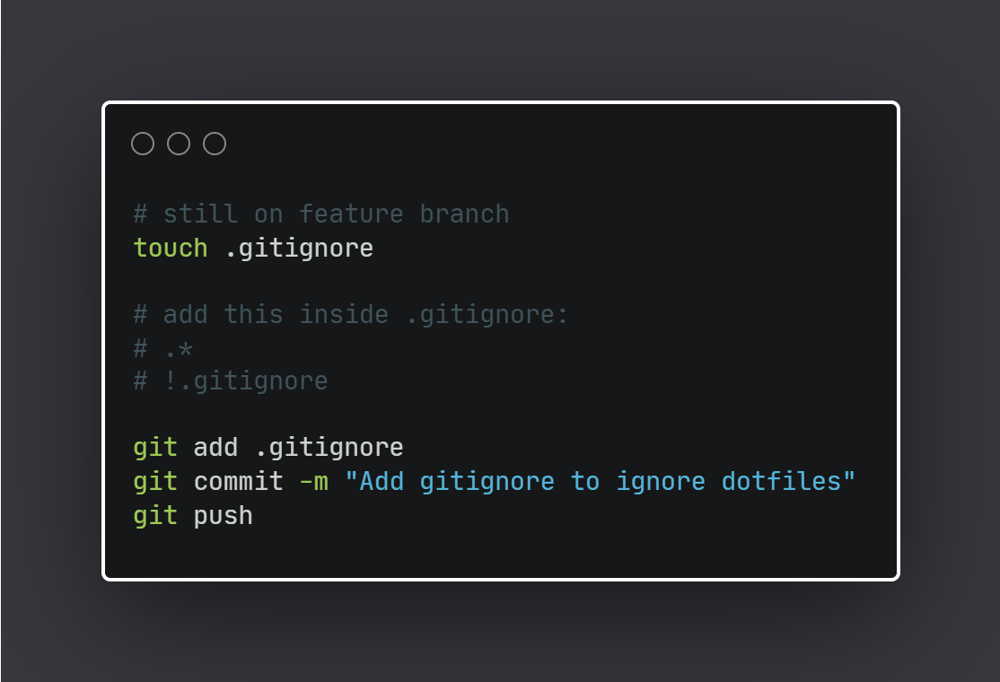
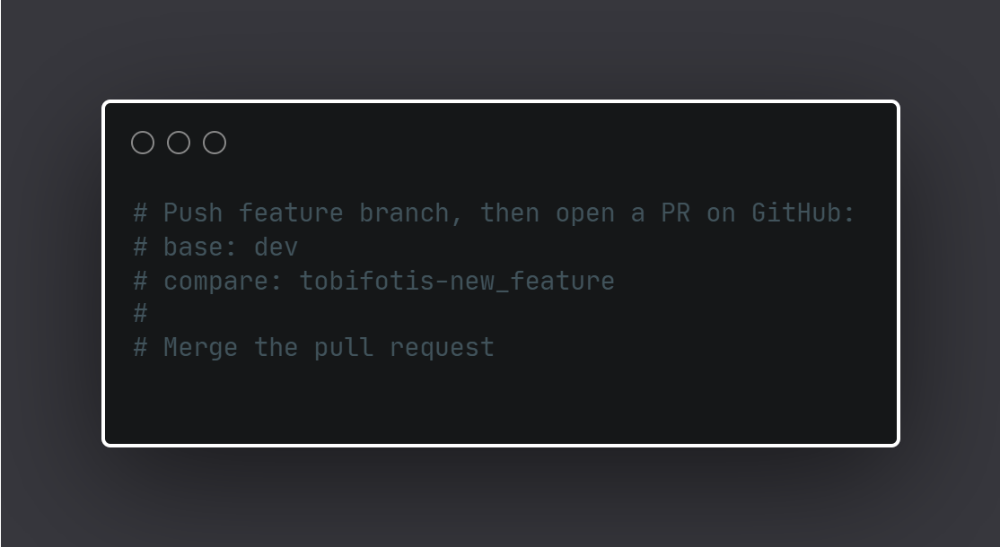
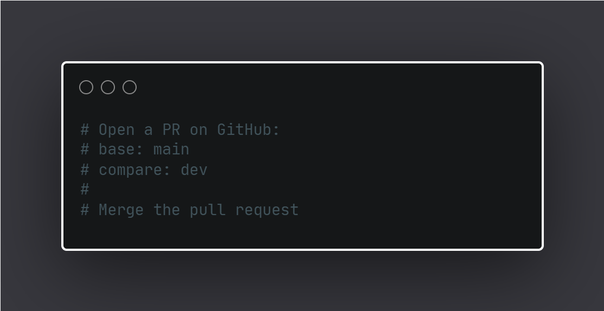
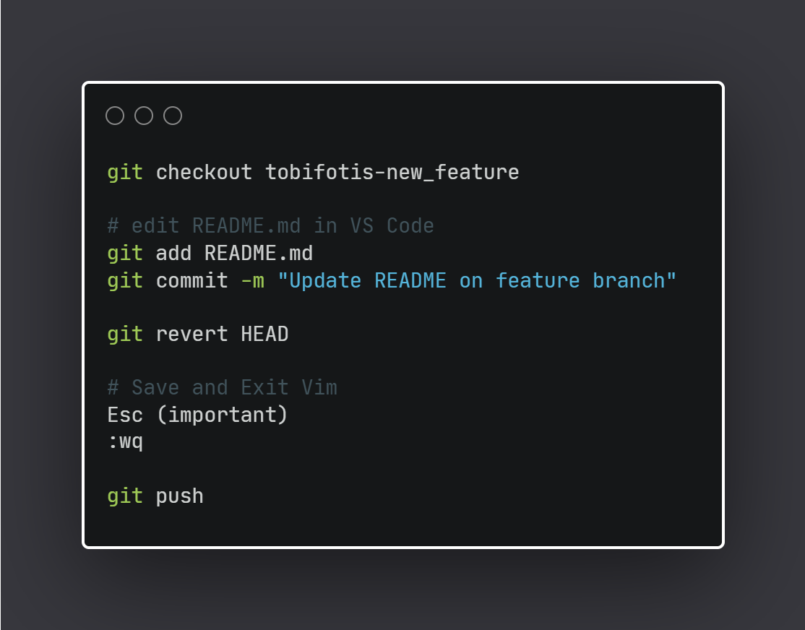

# Task 1 – Git & GitHub Fundamentals

## 📌 Objective
The goal of this task was to gain hands-on experience with Git and GitHub by practicing
repository setup, branching strategies, commits, pull requests, and branch management.


---

## 🚀 Step 1: Create Task1 Folder and README
The following commands were used to create the Task1 directory and push the initial README file to the main branch.

<p align="center">
  
</p>

---

## 🌱 Step 2: Create dev Branch and Push a Test File
A development branch was created to simulate active development work.

<p align="center">
  
</p>

---

## ✨ Step 3: Create Feature Branch
A feature branch named `%USERNAME-new_feature` was created to isolate changes.

<p align="center">
  
</p>

---

## 🛡 Step 4: Add .gitignore
A `.gitignore` file was added to ignore all dotfiles except `.gitignore` itself.

<p align="center">
  
</p>

---

## 🔁 Step 5: Pull Requests and Merging
Pull Requests were used to:
- Merge the feature branch into `dev`
<p align="center">
  
</p>

- Merge `dev` into `main`
<p align="center">
  
</p>

This ensures a clean and reviewable workflow.

---

## ⏪ Step 6: Reverting a Commit
A commit made on the feature branch was reverted using `git revert` to demonstrate safe undo operations.

<p align="center">
  
</p>

---

## 📜 Git Log
The full Git history was generated using the following command and saved to `log.txt`:

```bash
git log --oneline --graph --decorate --all
```

---

## 🧾 Git Commands Used
All Git commands executed during this task are documented in [git_commands.md](https://https://github.com/tobifotis/DevOps-internship-task/blob/main/Git-Github/Task1/git_commands.md)

---

## ✅ Result
This task demonstrates proper Git workflow usage including:
- Branching
- Commits
- Pull Requests
- Reverts
- Repository hygiene

---

## 🗂 Repository Structure
```
Git-Github/
└── Task1/
    ├── .gitignore
    ├── git_commands.md
    ├── log.txt
    ├── README.md
    └── test-file.txt
```
