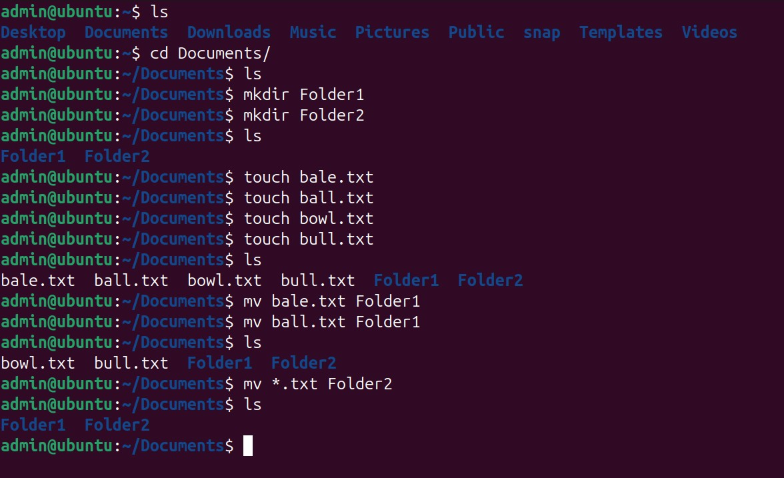
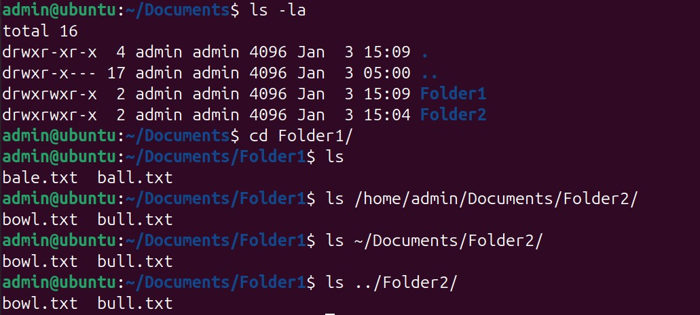
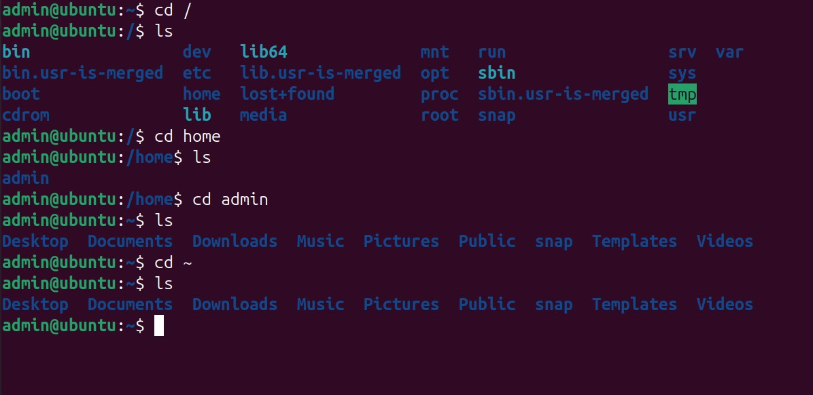
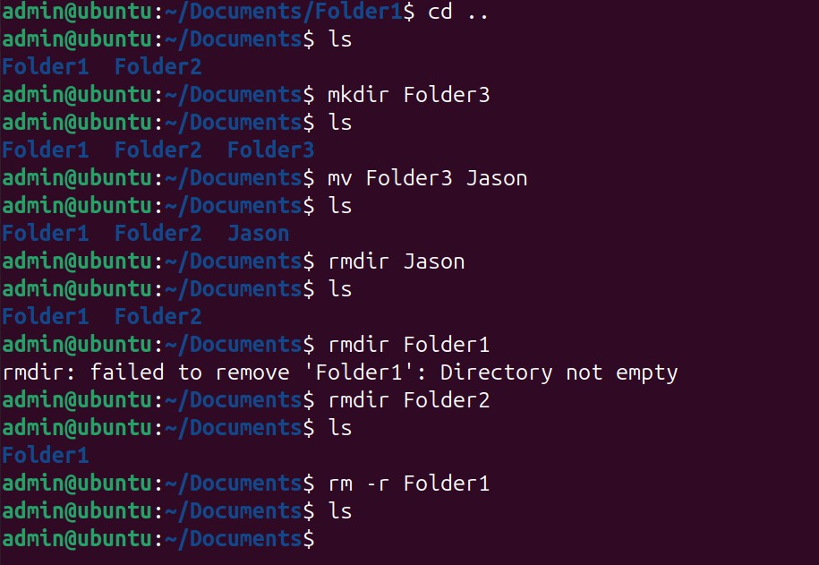
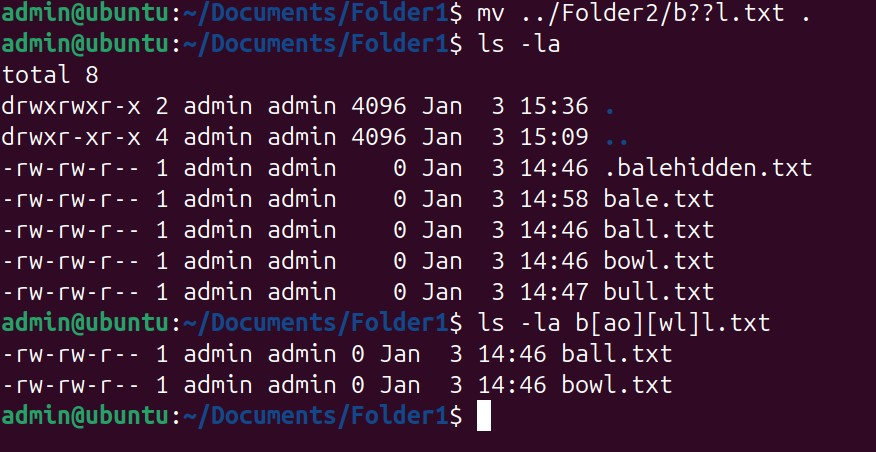

# Task 2: Linux Fundamentals

This README documents my hands-on Linux fundamentals practice as part of my DevOps internship at **Sigasi**.
Each section below maps exactly to the screenshots captured during the exercises and explains what was demonstrated.

---

## 1. Creating folders and files, moving with wildcards

**What this demonstrates**
- Navigating into `Documents`
- Creating directories and files
- Moving specific files into a folder
- Using the `*.txt` wildcard to move multiple files at once

---

## 2. Listing contents with absolute, relative, and home paths

**What this demonstrates**
- Viewing permissions and hidden entries
- Using absolute paths
- Using `~` for the home directory
- Using relative paths with `..`

---

## 3. Navigating the Linux filesystem hierarchy

**What this demonstrates**
- The Linux root directory structure
- Navigating through `/home`
- Difference between `/` and the user home directory
- Returning home with `cd ~`

---

## 4. Renaming and removing directories

**What this demonstrates**
- Renaming directories with `mv`
- Removing empty directories with `rmdir`
- Understanding why `rmdir` fails on non-empty directories
- Safely removing directories and contents using `rm -r`

---

## 5. Moving files using pattern matching

**What this demonstrates**
- Using `?` wildcards to match filenames of equal length
- Hidden files starting with `.`
- Moving only selected files based on a pattern
- Viewing permissions and ownership
- Using bracket wildcards to match specific filename combinations

---

## Summary

This task strengthened my understanding of:
- Linux directory navigation
- File and directory management
- Wildcards and pattern matching
- Hidden files and permissions
- Safe deletion practices

All commands were executed manually to reinforce understanding rather than memorization.
